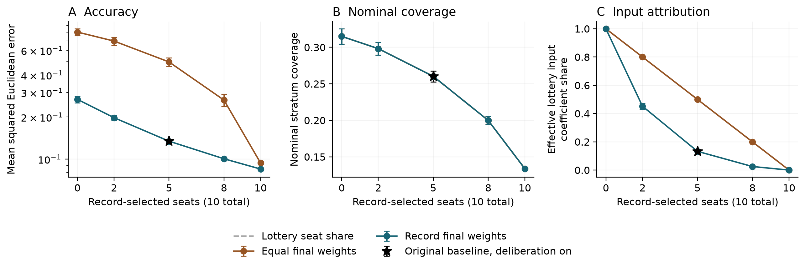

# PKD collective estimation study

This repository accompanies **Accuracy and influence in councils selected by track record and lottery**, by Aruma Harada. Version 2 (4 October 2026) examines a synthetic mechanism called Philosopher-King Democracy (PKD), with auditable results and a narrower account of what they show.

Read the [preprint PDF](paper/PKD_preprint_v2.pdf), [editable Word manuscript](paper/PKD_preprint_v2.docx), or [Markdown manuscript](paper/manuscript.md).

## What the experiments show

- PKD baseline squared error is 0.1344, compared with 0.8696 for an unweighted random council of ten and 0.6846 for the specified five-seat ballot election.
- Ten record-selected members perform better (0.0848), as does score-weighted aggregation of all 100 agents (0.0315). Lottery seats broaden nominal coverage of the model's strata.
- Seats and input weight differ. Lottery members occupy 50% of baseline seats but receive 13.26% of the coefficients on the estimates used to form the decision (12.27% in periods 30–299). These coefficients describe the realized calculation; they do not measure political power or equal participation.
- With deliberation disabled and the same five record-selected and five lottery-selected members, equal final weights give the lottery members 50% of input weight, while error rises from 0.1342 to 0.4955. The comparison holds council membership fixed. It exposes a choice between the measured accuracy and influence criteria under these assumptions.
- The full-period penalty from delayed feedback, and the tiny full-period improvement from removing deliberation, are concentrated near initialization. Later-window comparisons do not establish a persistent penalty or equivalence. Complete-neighborhood averaging is an exact limiting identity, not an explanation of every realized neighborhood.
- When information, council size, reselection and final averaging are aligned, a clean record-based ballot implements direct record selection after initialization ties. The default electoral gap is not a democracy-versus-expertise effect.
- Copying a noisy contemporaneous scoring target can undermine record selection. A one-period delay is not a universal defense.
- Honest-model errors are invariant to the world's regime-change rate by construction. This does not demonstrate adaptation to social change or causal policy effects.



## Reproduce the study

Recorded execution: Python 3.12.14 on Windows, NumPy 2.5.3, SciPy 1.18.1 and Matplotlib 3.11.2. The lockfile records the scientific/test dependencies. Compare numerical replay with floating-point tolerances across platforms.

```bash
python -m venv .venv
# Activate .venv for your operating system.
python -m pip install -r requirements-lock.txt
python -m pytest -q
python verify_preprint.py
python verify_review.py
```

The current suite has 21 passing tests. The first audit recalculates all 4,455,000 archived September period-system rows. The October audit checks all 99,000 new PKD coefficient rows, raw-to-run summaries, intervals, paired comparisons, matched council identities, four overlapping trajectories and source hashes. Verification of implementation does not establish real-world validity.

To run the studies again, use fresh output directories:

```bash
python reproduce_preprint.py --workers 4 --output results/rerun
python analyze_preprint.py --input results/rerun
python review_archived.py --input results/preprint_2026 --output results/review-rerun/archived_analysis
python review_followup.py --workers 4 --output results/review-rerun/followup
```

September contains **55 labeled batches but 54 distinct settings**, each with 30 runs and 300 periods: two labels use exactly the same setting, seeds and outputs. Thus 1,650 executed setting-runs represent 1,620 unique setting-seed combinations. October adds **11 settings × 30 runs × 300 periods**, reusing the September seeds; four settings repeat September configurations to add observation records. There are 61 distinct configurations across both studies. The follow-up and retrospective window analyses are exploratory and were not preregistered; they are not independent replications.

Workers process conditions and do not determine seeds. A small September smoke run is:

```bash
python reproduce_preprint.py --workers 1 --runs 2 --periods 18 --output smoke-output
python analyze_preprint.py --input smoke-output
```

The [CI workflow](.github/workflows/repro-smoke.yml) also runs a bounded October observer check using two archived seeds and the first 18 periods. See [REPRODUCIBILITY.md](REPRODUCIBILITY.md) for definitions, provenance and interpretation limits.

## Files and provenance

- `simulation_pkd_v32.py`: frozen September core retaining its historical filename. This repository release is version 3.4.0.
- `reproduce_preprint.py`: frozen execution script for all 55 September batch labels.
- `analyze_preprint.py`: run-based intervals, paired contrasts and figures.
- `results/preprint_2026/study_manifest.json`: inputs, seeds, environment, model and execution-script hashes.
- `results/preprint_2026/raw/`: compressed period traces and run summaries for every condition; baseline agent states, ballots and registered scores.
- `results/preprint_2026/analysis/`: estimates, contrasts, figures and artifact mapping.
- `review_archived.py`: post hoc reanalysis of delays, startup periods, matched council composition and dimensional scaling.
- `review_followup.py`: observer and predeclared 11-setting exploratory follow-up; the original simulator is unchanged.
- `results/review_2026/`: October raw coefficients, summaries, retrospective analyses and manifests.
- `verify_review.py`: independent recalculation of October results and provenance checks.
- `paper/`: preprint and complete ODD/experimental appendices.

Earlier drafts and the July archive did not match exactly. This release reports new runs of a corrected reconstruction, not recovery of an unavailable historical snapshot or independent-team replication. The default lottery includes all non-seated types; perfect type screening is only a sensitivity. Ballot ties and optional random streams have been corrected.

## Publication and scope

The manuscript is a preprint, not peer reviewed. No arXiv acceptance, journal submission or publication DOI is claimed here. AI assistance included code, analysis and substantive drafting and is disclosed. No human-subject data or empirical calibration is used.

The model assumes a shared exogenous state, stable observation traits and full feedback. It measures estimation error, nominal stratum coverage and conditional input coefficients. It does not establish a superior form of government. Changing the number of scored dimensions also changes the scale of record weights, and changing dimension changes several model features at once. See the paper for these couplings, information asymmetries and adversarial limitations.

Code uses the existing [MIT license](LICENSE). Manuscript copyright remains with the author; its preprint-platform distribution license is selected by the author on submission. See [CITATION.cff](CITATION.cff) for software citation information.
