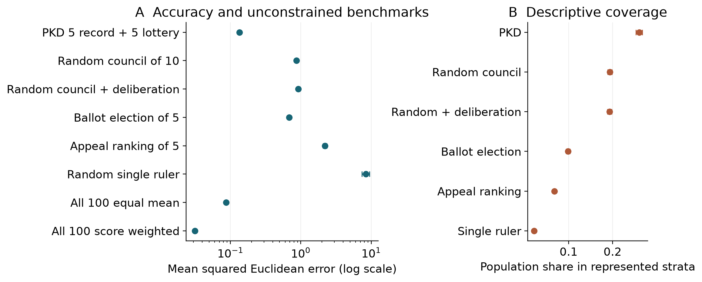

# PKD collective estimation study

This repository accompanies **Accuracy and representation tradeoffs in track record selected councils**, by Aruma Harada. The September 2026 preprint examines a synthetic mechanism called Philosopher-King Democracy (PKD). It does not establish a superior form of government.

Read the [preprint PDF](paper/PKD_preprint_v1.pdf), [editable Word manuscript](paper/PKD_preprint_v1.docx), or [Markdown manuscript](paper/manuscript.md).

## What the new experiments show

- PKD baseline squared error is 0.1344, compared with 0.8696 for an unweighted random council of ten and 0.6846 for the specified five-seat ballot election.
- Ten record-selected members perform better (0.0848), as does score-weighted aggregation of all 100 agents (0.0315). Lottery seats increase descriptive coverage of model strata; the hybrid is not the most accurate method.
- Removing the implemented deliberation step slightly reduces error. Complete-neighborhood averaging preserves the weighted aggregate exactly.
- When information, council size, reselection and final averaging are aligned, a clean record-based ballot implements direct record selection after initialization ties. The default electoral gap is not a democracy-versus-expertise effect.
- Copying a noisy contemporaneous scoring target can undermine record selection. A one-period delay is not a universal defense.
- Honest-model errors are invariant to the world's regime-change rate by construction. This does not demonstrate adaptation to social change or causal policy effects.



## Reproduce the study

Recorded execution: Python 3.12.14 on Windows, NumPy 2.5.3, SciPy 1.18.1 and Matplotlib 3.11.2. The lockfile records the scientific/test dependencies. Compare numerical replay with floating-point tolerances across platforms.

```bash
python -m venv .venv
# Activate .venv for your operating system.
python -m pip install -r requirements-lock.txt
python -m pytest -q
python reproduce_preprint.py --workers 4 --output results/rerun
python analyze_preprint.py --input results/rerun
```

The full study has 55 conditions x 30 runs x 300 periods. Workers process independent conditions and do not determine random seeds. A small smoke run is:

```bash
python reproduce_preprint.py --workers 1 --runs 2 --periods 18 --output smoke-output
python analyze_preprint.py --input smoke-output
```

Audit the archived full study:

```bash
python -m pip install pandas==3.0.1
python verify_preprint.py
```

The audit recalculates all 4,455,000 period-system rows, checks the frozen source hash, paired pre-shock identity, matched-election equivalence, and the population-mean analytical expectation. The 16 tests address numerical and causal invariants. This is implementation verification, not real-world validation.

## Files and provenance

- `simulation_pkd_v32.py`: corrected core retaining its historical filename. This study release is version 3.3.0.
- `reproduce_preprint.py`: all 55 conditions and run execution.
- `analyze_preprint.py`: run-based intervals, paired contrasts and figures.
- `results/preprint_2026/study_manifest.json`: inputs, seeds, environment, model and execution-script hashes.
- `results/preprint_2026/raw/`: compressed period traces and run summaries for every condition; baseline agent states, ballots and registered scores.
- `results/preprint_2026/analysis/`: estimates, contrasts, figures and artifact mapping.
- `paper/`: preprint and complete ODD/experimental appendices.

Earlier drafts and the July archive did not match exactly. This release reports new runs of a corrected reconstruction, not recovery of an unavailable historical snapshot or independent-team replication. The default lottery includes all non-seated types; perfect type screening is only a sensitivity. Ballot ties and optional random streams have been corrected.

## Publication and scope

The manuscript is a preprint, not peer reviewed. No arXiv acceptance, journal submission or publication DOI is claimed here. AI assistance included code, analysis and substantive drafting and is disclosed. No human-subject data or empirical calibration is used.

The model assumes a shared exogenous state, stable observation traits and full feedback. Representation metrics do not measure rights, legitimacy or equal political influence. See the paper for information asymmetries and adversarial limitations.

Code uses the existing [MIT license](LICENSE). Manuscript copyright remains with the author; its preprint-platform distribution license is selected by the author on submission. See [CITATION.cff](CITATION.cff) for software citation information.
