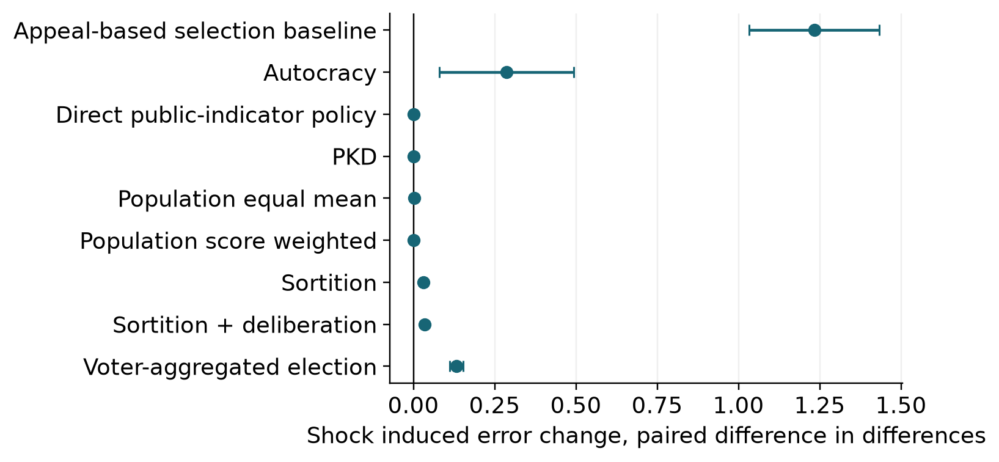

# Accuracy and influence in councils selected by track record and lottery
Aruma Harada
Independent Researcher
ORCID 0009-0005-6674-5165
Preprint version 2 | 4 October 2026 | Not peer reviewed

## Abstract
Can a small council combine accurate estimates with broader representation through lottery seats? I examine Philosopher-King Democracy (PKD), a synthetic collective-estimation model combining five seats selected by past accuracy, five stratified lottery seats and bounded-confidence averaging. The original study contains 54 distinct parameter settings, each evaluated with 30 runs of 300 periods. Baseline squared error is 0.1344 for PKD, 0.8696 for a random council of ten and 0.6846 for the specified five-seat election. Ten record-selected seats achieve 0.0848, and score-weighted aggregation of all 100 agents achieves 0.0315. An exploratory follow-up separates council composition, aggregation weights and the influence of lottery members. Lottery members hold 50% of baseline seats but receive 13.3% of the realized input coefficients. With averaging disabled in both weighting conditions, equal input weights increase error while leaving membership unchanged. Removing the averaging step slightly reduces full-run error, mainly during initialization. Under matched information and procedures, clean record-based ballots reproduce direct record selection after initialization. Delayed feedback raises full-run error mainly through initialization; the later-window comparisons do not show a consistent continuing penalty under fixed observation-noise parameters and the specified bias shock. Scoring-indicator copying exposes a separate timing vulnerability. The study identifies conditional relationships among estimation accuracy, nominal representation and realized aggregation influence. Its assumptions and results do not establish performance in real political institutions.

Keywords: agent-based simulation; collective estimation; prediction aggregation; sortition; bounded confidence; model verification

## 1 Introduction
Past predictive performance offers one way to select advisers when competence is uncertain. A council selected only for past accuracy, however, need not include a broad range of participants. The PKD proposal combines performance-based selection with reserved lottery seats. Its research question is whether this combination preserves useful accuracy while broadening nominal stratum coverage within a fixed council size, and which assumptions make that result possible. The name is retained to identify the proposal; philosophical wisdom, political authority and democratic legitimacy are not variables in the model.

This question requires stronger comparators than an appeal-only ranking. If one mechanism uses individual accuracy records while another cannot access them, a performance gap conflates the institutional rule with its information. If all agents already submit estimates for scoring, pooling all those estimates is another available benchmark. A useful analysis must also separate record-based selection, record-based policy weights, lottery composition and deliberation, rather than assign all gains to their combination.

The present study is a mechanism experiment with synthetic agents. It evaluates a common state-estimation task, not a causal policy intervention. The selected policy vector does not change the subsequent world. This permits every agent to receive feedback about the same target, but removes a central difficulty of governance: observing what would have happened under policies that were not chosen. Squared estimation error therefore has a precise interpretation here, whereas social welfare, rights, distributive justice and institutional legitimacy do not.

The contribution is a reproducible comparison of a particular hybrid rule and its components under explicit information and timing assumptions. The September archive contains 55 labeled batches but 54 distinct parameter settings: one interaction reference repeats an existing setting with the same seeds. Its 1,650 executions therefore contain 1,620 unique setting-seed combinations, each of 300 periods. The October revision adds an explicitly exploratory analysis of initial versus later performance and a controlled council-composition follow-up. The study includes paired shock controls, equal-information elections, unconstrained aggregation, representation diagnostics and simple adversarial strategies. It does not introduce performance weighting or heterogeneous bounded confidence as new ideas, and it makes no claim of exhaustive institutional or algorithmic optimality.

## 2 Relation to prior work
Performance-based aggregation belongs to the established literature on prediction with expert advice. Cesa-Bianchi and Lugosi (2006) analyze weighted prediction and its limitations. PKD's exponentially transformed, discounted squared-error records are related to that family, but this study establishes no regret guarantee: losses are unbounded under Gaussian observations, council membership is restricted, and the rule is not derived as an optimal forecaster. The full-population score-weighted comparator tests whether the council restriction discards useful information.

Opinion averaging likewise predates this model. DeGroot (1974) studies consensus by pooling opinions; Hegselmann and Krause (2002) study bounded confidence; Lorenz (2010) explicitly treats heterogeneous confidence bounds. Golub and Jackson (2010) investigate conditions under which social learning aggregates information. PKD uses a single synchronous, bounded-confidence update on each period's fresh estimates. It does not model argument exchange, acquisition of new evidence, deliberative legitimacy, or permanent improvement in individual ability. The analytical observation in Section 3 states a sufficient condition for exact aggregate invariance. It does not by itself establish why the baseline change is small, because the baseline need not have complete confidence neighborhoods.

Sortition research distinguishes descriptive composition from the fairness of individual inclusion probabilities. Flanigan et al. (2021) develop selection algorithms for citizens' assemblies and evaluate fairness using assembly data. PKD instead uses a simple largest-remainder allocation across synthetic strata. This is a convenient experimental rule, not a claim to reproduce those algorithms or their fairness guarantees. Moreover, selection opportunity, nominal seats and realized aggregation influence are different quantities. The October follow-up directly measures the last two and records the fraction of agents ever seated over the finite simulation; it does not estimate equal long-run inclusion probabilities.

Hong and Page (2004) examine how diverse problem-solving perspectives can improve collective search under specific assumptions. Their result is not a theorem about averaging independent Gaussian measurement errors; a poor performance of lottery seats here does not refute their model. Conversely, that literature does not establish that adding lottery seats must improve PKD's estimation accuracy. The two models represent different sources of diversity and different collective tasks.

Empirical forecasting studies motivate evaluating records, but do not calibrate this simulation. Mellers et al. (2014) studied probabilistic judgments of geopolitical events and found benefits from training, teaming and tracking. Their task used resolved questions and human participants; PKD uses continuous contemporaneous estimates, fixed observation distributions and an exogenous target. No numerical parameter in the present model is fitted to those data. Brennan (2016) provides a philosophical context for competence-based political selection. His hobbit, hooligan and vulcan taxonomy is not the four-type population used here; the four citizen labels below are author-defined operational combinations.

The distinction between a model's exploratory purpose and an empirical predictive purpose follows Edmonds et al. (2019). The model description in Appendix A follows the seven elements of ODD (Grimm et al., 2020). Documentation and software tests improve inspectability; they do not by themselves validate an institutional interpretation.

## 3 Model and analytical expectations
### 3.1 State and registered estimates
There are 100 agents: 80 synthetic citizen agents, 15 initially low-noise agents, and five agents labeled demagogues in the code. The last label means a stipulated combination of high appeal, biased estimates and relatively low confidence bounds. It is not a validated classification of people or an operationalization of populism. All agents are eligible for record seats and, by default, for lottery seats if they are not already selected. The selection rule never excludes an agent because of the demagogue label.

The state θ(t) has ten dimensions at baseline. It begins as a centered Gaussian vector with per-coordinate standard deviation 0.5. Before each decision, it is redrawn from N(0,I) with probability 0.03; otherwise independent Gaussian drift of standard deviation 0.02 is added. Each agent registers a vector x_i(t) with fixed bias b_i and independent coordinate errors. One or two randomly assigned specialty coordinates have 0.3 times the agent's usual observation-noise standard deviation.

$$
x_i(t)=\theta(t)+b_i+\varepsilon_i(t),\qquad L_s(t)=\|p_s(t)-\theta(t)\|^2
$$

Citizen noise standard deviations are 0.6, 1.3, 0.5 and 1.5 for the four operational types; low-noise agents have 0.3 and labeled demagogues 0.8. Only the latter have a nonzero bias, initially of norm 1.5 in an independently random direction. At zero-based period 100, their bias norm doubles and appeal is multiplied by 1.5. This is a defined parameter intervention, not an estimate of a historical political shock. Appeal can exceed one after the intervention because it is a score rather than a probability.

Every system reads the same registered estimates in a run. A scoring indicator y(t)=θ(t)+η(t), with independent Gaussian coordinate noise of standard deviation σ_y, becomes available for feedback. Baseline σ_y is zero. A score uses the first q coordinates, with q=10 at baseline, and an optional feedback delay δ. Records available for a decision contain only updates from earlier periods. An estimate is never replaced by its post-deliberation value for scoring.

$$
R_i(t+1)=\alpha R_i(t)-(1-\alpha)\sum_{k=1}^{q}[x_{ik}(t)-y_k(t)]^2\quad(\delta=0)
$$

R_i initially equals zero; α=0.9. With delay δ, the score of the estimate made in period t−δ updates R at the end of period t; during the first δ periods no update is available. All agents are scored once when feedback arrives, whether or not seated. This full-feedback assumption is favorable to learning and differs from selective, action-dependent policy feedback.

### 3.2 Selection and aggregation
PKD reselects a ten-person council every six periods. It first selects five agents with the highest prior records, with seeded random tie-breaking. Five distinct remaining agents are selected by a stratified lottery. Strata are primary specialty, operational archetype and tolerance bin. Seats are apportioned to strata by largest remainder, with random ties, and sampled without replacement within selected strata. Five seats cannot cover every stratum. The rule presumes the stratum attributes are available; it does not show that comparable real-world classifications would be observable or legitimate. Uniform-lottery and perfectly type-screened alternatives are examined separately.

Within a council C, record weights are proportional to exp(R_i). These are heuristic performance weights, not statistical precisions. The rule fixes the exponential score scale at one. Changing the units of squared error changes weight concentration unless that scale is adjusted; no scale-invariant or optimal weighting claim is made. Each member's confidence neighborhood contains council estimates within that member's Euclidean tolerance, including the member's own estimate. All post-deliberation estimates are computed synchronously from the registered inputs. A partial step of size ρ=0.3 moves each estimate toward the record-weighted neighborhood mean; PKD then uses the record-weighted mean of those updated estimates.

$$
w_i=\frac{e^{R_i}}{\sum_{j\in C}e^{R_j}},\qquad N_i=\{j\in C:\|x_j-x_i\|\le\tau_i\}
$$

$$
z_i=(1-\rho)x_i+\rho\frac{\sum_{j\in N_i}e^{R_j}x_j}{\sum_{j\in N_i}e^{R_j}},\qquad p=\sum_{i\in C}w_i z_i
$$

The random-council comparator samples ten agents without replacement every six periods and averages their estimates equally. A separate random-council condition applies the same confidence rule with equal local weights. The single-ruler diagnostic selects one random agent every 48 periods. Appeal ranking selects the five highest values of appeal plus N(0,0.2²) every 12 periods. These diagnostics are called sortition, autocracy and appeal ranking in the code; they are deliberately sparse mechanisms, not comprehensive models of political regimes.

The ballot-election comparator is distinct from appeal ranking. All 100 agents vote and may be candidates. Each casts five unweighted approvals for the five candidates with highest private utility, and the five candidates with the most approvals form the council. Utilities combine a noisy public individual record with policy-position proximity, speaking skill, campaign cues, shared party identity and collective incumbent outcomes. The relative weight of the record channel is 0.25 at baseline. Elections occur every 12 periods and elected estimates are averaged equally. Voters never directly inspect candidate observation-noise parameters; Appendix A specifies all signals and transformations. This artificial multiwinner rule does not represent electoral democracy in general.

Two additional comparators average all 100 registered estimates, either equally or with the same score weights. They have no small-council participation constraint. Because PKD already obtains estimates from everyone, the informational feasibility of this benchmark is part of its own premise. A final diagnostic directly implements the contemporaneous scoring indicator. With a perfect indicator it has zero error by construction; it receives information before action that ordinary mechanisms receive only as feedback. It is an oracle timing check, not a feasible baseline under the ordinary information schedule.

### 3.3 Why the components need separate tests
Suppose all council members have the full council as their confidence neighborhood. Let p be the weighted mean of registered estimates using fixed normalized record weights. Each revised estimate is then (1−ρ)x_i+ρp. Averaging again with the same weights gives p exactly. Deliberation cannot improve this aggregate when everyone uses the same full neighborhood. With heterogeneous neighborhoods it can change the aggregate, but any benefit must arise from that asymmetry, not from new evidence. The identity is elementary and is verified in the regression tests; no novel convergence theorem is claimed.

$$
\sum_{i\in C}w_i[(1-\rho)x_i+\rho p]=(1-\rho)p+\rho p=p
$$

The all-population equal mean provides an independent numerical check. For fixed agent biases and independent observation errors, its expected squared error is the squared mean bias plus the sum of observation covariance traces divided by N². Averaging also over independent random bias directions, randomly assigned specialties, and the 100 pre-shock and 200 post-shock periods gives the baseline expectation 0.087817. The observed simulation estimate is 0.0876 [0.0867, 0.0884]. This check tests observation scaling and aggregation without invoking the record-selection implementation.

$$
E\|\bar{x}-\theta\|^2=\|N^{-1}\sum_i b_i\|^2+N^{-2}\sum_i\mathrm{tr}(\Sigma_i)
$$

The comparison with a clean record-based ballot has a similarly transparent limit. If all voters put weight one on identical records, there is no utility noise, the ballot size equals the council size, and scores are untied, all voters approve the same top candidates. This gives exactly the record-selected set. Aligning council sizes, reselection periods and final averaging therefore removes a supposed institutional distinction in this special case. Remaining initialization differences result from random tie-breaking at zero records.

There is also a structural invariance that limits a dynamic interpretation. In the absence of herding or lagged-indicator copying, the common current state cancels from estimate differences, scoring errors and final policy errors. Each estimate equals the same state plus an agent-specific error, and every averaging rule preserves the common-state term. Electoral positions are fixed rather than tied to the changing state. Consequently, changing the state's drift or regime-change frequency does not test adaptive competence in the honest model. Records learn relative measurement quality, not a changing state-transition law. This is an analytical property of the specification, verified numerically in the sensitivity runs.

### 3.4 Seats and realized aggregation influence
For a realized council, let A have one row for each member's normalized neighborhood weights and let w be the final aggregation weights. Each row of A sums to one. The aggregate is a convex combination of the original registered estimates, with coefficient vector v=(1−ρ)w+ρAᵀw. With deliberation disabled, v=w. The total coefficient on agents occupying lottery seats measures how much their registered estimates enter that period's aggregate.

$$
v_j=(1-\rho)w_j+\rho\sum_{i\in C}w_i A_{ij},\qquad \sum_{j\in C}v_j=1
$$

These coefficients sum to one and reconstruct the implemented output. They describe the realized computation conditional on the council, records and confidence neighborhoods. They are not causal derivatives: changing an estimate can also change neighborhood membership. Nor do they measure political rights, bargaining power or the importance of a person's concerns. The concentration diagnostic N_eff=1/Σ_j v_j² equals ten for ten equal coefficients and approaches one if a single input dominates. It is a descriptive equivalent count, not an independent sample size.

## 4 Experimental design and verification
All estimates derive from the deposited September simulations or the October follow-up, rather than unverified historical manuscript values. The original archive uses 55 labeled batches representing 54 distinct configurations, 30 seeds per configuration and 300 periods per run. The batches expert_noise_0.9 and interaction_noise_0_delay_0 are identical; their records are not pooled or counted as independent evidence. The same 30 run seeds, derived from root seed 20260927, are reused across conditions. A run uses independent random streams for world dynamics, agent traits, observations, indicators, strategies and selection mechanisms. For interventions that preserve population and dimensionality, common random streams support paired comparisons. Changing population composition or dimensionality changes the mapping of random draws and is treated as a sensitivity comparison, not an identical-observation experiment.

The primary outcome is each run's average squared Euclidean error over all 300 periods, including initialization; smaller values are better. Code exports also retain its negative as mean_performance. The unit of replication is the run, not the agent or period. Reported intervals are two-sided 95% Student-t intervals across 30 runs. Component contrasts use the 30 within-seed differences. These are pointwise Monte Carlo intervals conditional on model assumptions, not population-inference intervals about governments. The experiments are exploratory, were not preregistered, and are not interpreted using a family of thresholded significance tests.

The counterfactual shock experiment pairs the baseline with a no-shock run under the same seed. Its difference-in-differences is the post-minus-pre error change with the shock minus that change without it. The pre-window is periods 0–99 and the post-window 100–299. A raw improvement with time alone would mix the shock with score learning and is not interpreted causally. Named streams and a draw-free shock intervention preserve identical pre-shock observations.

Representation is measured separately from accuracy. Coverage is the fraction of the full population belonging to at least one stratum represented in a council. Normalized Jensen–Shannon divergence and total variation compare council and full-population stratum frequencies. These measures describe the particular model attributes. They do not measure opinion legitimacy, rights, individual inclusion fairness or realized aggregation influence; the latter is measured separately in the follow-up. The direct-indicator diagnostic has no council and is excluded from representation comparisons. Full-population aggregation is also shown separately from small councils.

The software tests check deterministic replay, exactly one score update, score invariance to deliberation, independent optional-comparator streams, random tie-breaking in ballots, legitimate local normalization under extreme scores, pre-shock pairing and recovery of the top-score set by a clean ballot. Baseline agent states, election votes and registered scores are archived alongside all condition-level period traces, run summaries, seeds and resolved configurations. These are verification checks within one implementation lineage. Neither an independent-team replication nor empirical calibration is claimed.

The October follow-up was chosen after inspecting the September results and is not a preregistered confirmation. Initial periods 0–29 are separated from periods 30–299: the cutoff exceeds the longest examined delay of 24 periods and reaches the next six-period council rotation. Periods 90–299 provide an additional later-window check. These partitions summarize the recorded trajectories; they do not prove convergence or absence of smaller effects. All window contrasts still use one mean per run and the same paired seeds.

The council follow-up holds size at ten and varies record seats over 0, 2, 5, 8 and 10, crossed with equal or score-based final weights and with deliberation disabled. A replay of the original deliberating five-plus-five baseline is the eleventh condition. All conditions reuse the original 30 seeds and 300 periods, giving 330 executions and 99,000 PKD period records. Four configurations repeat September settings; these replays add influence observations rather than independent replication. The observer calls the original decision method, draws no random numbers, returns the original output unchanged and checks reconstruction using the coefficient vector in Section 3.4. At a fixed seat mix, weighting changes leave registered estimates, records and council selection unchanged in these honest-agent conditions. A manifest fixes the follow-up grid and source hashes before execution, after the exploratory question was chosen.

Score-projection sensitivities jointly change which coordinates are evaluated, uncertainty in their ranking and the magnitude of the summed score entering exponential weights. They do not isolate an information-content effect. Changing dimensionality also changes the summed-error scale, weight concentration and confidence-neighborhood distances. The record-decay parameter additionally controls collective incumbent-memory decay in the election. These couplings are retained in the archived specification and stated as interpretive limits.

## 5 Results
### 5.1 Accuracy depends on the available comparator
PKD's mean error is 0.1344 [0.1316, 0.1372], compared with 0.8696 [0.8557, 0.8836] for a random council of ten and 0.6846 [0.6563, 0.7129] for the default election. The unrestricted population mean achieves 0.0876 [0.0867, 0.0884]; using score weights for all agents lowers it further to 0.0315 [0.0312, 0.0319]. Thus the hybrid council is not the most accurate aggregator among the tested mechanisms. Its stratum coverage is 26.0%, compared with 19.4% for the random council and 9.9% for the five-seat election. These comparisons confound council size unless size is explicitly matched.

Table 1. Baseline outcomes across 30 runs. Error is the squared Euclidean distance summed across ten dimensions. Brackets give 95% Monte Carlo intervals. Coverage concerns nominal council membership.

| Mechanism | Error [95% interval] | Biased type seats | Coverage |
| --- | --- | --- | --- |
| PKD | 0.1344 [0.1316, 0.1372] | 1.1% | 26.0% |
| Random council of 10 | 0.8696 [0.8557, 0.8836] | 4.8% | 19.4% |
| Random + deliberation | 0.9221 [0.9059, 0.9383] | 5.3% | 19.3% |
| Ballot election of 5 | 0.6846 [0.6563, 0.7129] | 11.9% | 9.9% |
| Appeal ranking of 5 | 2.2092 [2.0702, 2.3482] | 72.4% | 6.8% |
| Random single ruler | 8.3846 [7.3461, 9.4230] | 4.4% | 2.1% |
| All 100 equal mean | 0.0876 [0.0867, 0.0884] | 5.0% | 100.0% |
| All 100 score weighted | 0.0315 [0.0312, 0.0319] | 5.0% | 100.0% |

Figure 1. Baseline accuracy and descriptive coverage. Points and bars show run means and 95% Monte Carlo intervals. The horizontal error axis in panel A is logarithmic. Population aggregation uses all 100 estimates and is not constrained to a small council; the perfect contemporaneous-indicator diagnostic is omitted from the log axis because its error is zero.

The appeal-ranking diagnostic overselects the high-appeal biased type partly because that association is built into the population. Its large error is not evidence that real voters ignore competence. The single-ruler comparison is also strongly affected by its single-person sample and long tenure. These contrasts locate the hybrid rule among the specified algorithms; the component and information-matched experiments are more informative about its mechanism.

### 5.2 Council composition and aggregation weights have separate effects
Ten record seats yield error 0.0848 [0.0833, 0.0862], while baseline PKD has coverage 26.0% compared with 13.4% for ten record seats. Removing deliberation changes full-run error by -0.000187 [-0.000265, -0.000109], about 0.14% of baseline error. That small reduction is concentrated during initialization: the paired difference over periods 30–299 is 0.000013 [-0.000004, 0.000031], and over 90–299 is 0.000005 [-0.000007, 0.000016]. Thus no sustained accuracy improvement from removing this operator is established. Ten lottery seats with score weighting give error 0.2675 [0.2529, 0.2820]; equal final policy weights with the original deliberation retained give 0.4767 [0.4417, 0.5118]. This latter change leaves local neighborhood weights score-based. A uniform lottery changes error by -0.0005 [-0.0032, 0.0022] and lowers coverage to 18.5%. Perfect type screening reduces labeled-demagogue occupancy but raises error to 0.1444. Freezing all records at period 100 changes error by 0.0001 [-0.0017, 0.0020], consistent with little additional benefit of continued updating under the largely stable observation traits.

A cleaner composition comparison disables deliberation in both ten-seat councils and retains score weighting. Replacing five record seats with five stratified lottery seats then increases mean error by 0.0495 [0.0466, 0.0523], or 58.3% relative to the record-only mean. It increases nominal stratum coverage by 12.65 [11.99, 13.31] percentage points. This is a within-model accuracy–coverage tradeoff; the percentage error increase is not a welfare percentage.

Figure 2. Component interventions. Panel A shows paired changes in error relative to baseline PKD, with negative values indicating smaller error. Panel B shows descriptive stratum coverage. The ten-lottery-seat comparator still weights estimates by their records. Type screening uses hidden agent labels to exclude all non-citizen types and is a deliberately favorable eligibility assumption rather than the default.

Removing lottery seats and keeping ten record seats changes both composition and participation. It is not a welfare improvement by definition: the model provides no welfare function that trades representation against accuracy. Conversely, a higher coverage score cannot establish better substantive representation. Largest-remainder allocation over many small strata can concentrate selection on the larger cells, and high prediction weights can reduce the influence of nominally represented members. The rule is not a demonstrated optimum for either fairness or accuracy.

### 5.3 Lottery membership and influence differ
In the original baseline, lottery members occupy five of ten seats but their registered estimates receive only 13.3 [11.9, 14.6]% of the realized input coefficients. Over periods 30–299 this share is 12.3 [11.0, 13.6]%. The equivalent input count is 6.11 [6.00, 6.23], compared with ten when every original input has equal weight. Across all 300 periods, 44.3 [42.2, 46.4]% of agents are seated at least once, and 32.4 [30.3, 34.5]% are seated through the lottery at least once. These finite-run fractions measure participation over time, not individual inclusion fairness.

With deliberation disabled and the same five-plus-five councils, score weighting gives error 0.1342 [0.1315, 0.1370], compared with 0.4955 [0.4615, 0.5296] for equal weighting. The paired score-minus-equal difference is -0.3613 [-0.3934, -0.3292]. Equal weighting gives lottery estimates exactly 50% of total weight; nominal membership and stratum coverage are identical in the paired runs. The low-error hybrid therefore combines broader nominal membership with strongly unequal input weights in this population. Across the five tested seat mixes, more record seats reduce mean error and nominal coverage under both weighting rules. At eight record seats, the two lottery members receive only 2.5 [2.1, 3.0]% of the input weight under score weighting. These results do not identify an optimal allocation.

![Figure 3. Exploratory fixed-size council comparison. The lines disable deliberation, and ten seats are divided between record selection and stratified lottery. Points summarize the same 30 seeds. The weighting comparison uses identical council draws at each seat allocation. The black star replays the original baseline with deliberation enabled; panel A uses a logarithmic error scale. Realized influence is the sum of original-estimate coefficients for current lottery-seat members; it is not a political-power measure.](../results/review_2026/followup/analysis/figure_followup.png)

Figure 3. Exploratory fixed-size council comparison. The lines disable deliberation, and ten seats are divided between record selection and stratified lottery. Points summarize the same 30 seeds. The weighting comparison uses identical council draws at each seat allocation. The black star replays the original baseline with deliberation enabled; panel A uses a logarithmic error scale. Realized influence is the sum of original-estimate coefficients for current lottery-seat members; it is not a political-power measure.

The seat-mix grid tests only the declared allocations and weights. It supplies no social objective for trading accuracy against representation or influence, and therefore does not select an optimal political design. The coverage score concerns the same model strata used by the selection rule; alternative attributes could rank councils differently.

### 5.4 Giving voters records narrows the information gap
With a clean public record channel, the election's error falls from 1.6609 [1.6010, 1.7208] at record weight zero to 0.2121 [0.2046, 0.2196] at weight 0.75. At weight one it is 0.2251 [0.2116, 0.2386]; the five-point sweep is not strictly monotonic. Even at weight one, the ordinary election retains random utility noise and differs in aggregation and schedule, so it need not coincide with direct record selection. At record weight 0.75, information error of 2 raises election error to 0.7335, and campaign contamination of 2 raises it to 0.7003.

Figure 4. Electoral information experiments. Panel A removes public information error and media contamination while varying weight on the individual record. Panels B and C use record weight 0.75 and perturb one information channel. Each point uses the same 30 seeds; PKD is invariant to these electoral-only interventions. A positive gap means higher error in this specified election.

The default election differs from PKD in council size, reselection schedule, aggregation weights and preferences as well as information. Its baseline gap cannot isolate a democracy-versus-expertise effect. In the matched comparison, both mechanisms use five members, six-period reselection and equal policy weights; the election uses identical records with no other utility component. The full-period paired election-minus-record-selection error difference is 0.0027 [-0.0063, 0.0117]. After the first six periods, the largest absolute period-level difference across all 30 runs is below 10⁻¹², consistent with floating-point rounding. This confirms the limiting argument in Section 3: the record channel is available to multiple selection rules, not uniquely to PKD.

### 5.5 Feedback quality and timing require separate interpretations
At indicator-noise standard deviations 0.5, 1 and 2, PKD errors are 0.1399, 0.1607 and 0.3714, respectively. Delays of 3, 12 and 24 periods yield 0.1397, 0.1647 and 0.1935. Scoring only one coordinate gives error 0.2687, while three and five coordinates give 0.1440 and 0.1334. These are specification sensitivities: coordinate restriction changes score scale as well as information. The grid does not identify a universal failure threshold.

The full-run delay comparison mixes startup and subsequent operation. In the post hoc periods 30–299 window, baseline error is 0.129742; delays 3, 12 and 24 have paired differences 0.000195 [-0.001318, 0.001709], 0.000459 [-0.000846, 0.001764] and -0.000133 [-0.001673, 0.001408]. The periods 90–299 comparisons likewise have intervals spanning zero (deposited tables). The sizable full-run penalties are mainly initial costs of starting with zero records and delayed feedback. These estimates neither establish equivalence nor predict behavior under repeated, unanticipated changes in individual competence. Figure C1 separates the initial and later windows.

Figure 5. Shared scoring-channel interventions. Points average all 300 periods, including initialization. Delay affects individual records; electoral incumbent feedback remains immediate. Projection to the first q coordinates changes both information and score scale. These are coupled specification sensitivities, not isolated information-quality effects.

The strategy experiments give the labeled demagogues access to specific extra information. Independent and coordinated herding use the previous PKD output while agents are outside the previous council, returning to their biased estimates while seated. Indicator targeting copies the current scoring indicator. The lagged-indicator alternative permits only the preceding period's indicator. These are specified attack rules, not learned optimal strategies or a complete equilibrium model. Since strategic behavior depends on the previous PKD council, the same modified estimates are supplied to every comparison system; cross-system results in these conditions are not separate strategic equilibria.

Independent and coordinated herding raise PKD error to 0.2093 and 0.2129, and labeled-agent occupancy to 7.5% and 7.6%. Copying a perfect current indicator produces low error (0.0106) despite occupancy of 49.1%. Copying noisy current indicators instead gives error 2.4173 at noise 0.5 and 9.8530 at noise 1, with approximately half of the council occupied by labeled agents. Restricting copying to the previous period yields errors 0.1395 and 0.1609 for those noisy indicators. However, lagged copying of a perfect indicator still gives error 0.3210 and occupancy 35.5%. A one-period separation is therefore not a general guarantee against gaming.

Figure 6. PKD under specified strategic rules. Current-indicator access is an intentional violation of the ordinary register-before-feedback schedule. Noise refers to the indicator's per-coordinate standard deviation. Lagged-indicator access enforces a one-period separation but does not establish general resistance to gaming. Occupancy is not equivalent to error: copying a perfect current indicator can gain seats while producing accurate estimates.

The current-indicator attack is a timing failure with an exact explanation: copying the scoring target yields a zero scoring loss even when the target is noisy relative to θ. Its success cannot establish that any realistic metric manipulation has the same magnitude. Equally, its artificial simplicity does not justify overlooking the need to prevent contemporaneous target leakage. A model of genuine institutional metric manipulation would require endogenous indicators, selective reporting, strategic objectives and policy-dependent consequences.

### 5.6 Shock controls and sensitivity boundaries
The paired shock-induced increase in PKD error is 0.0000106 [0.0000012, 0.0000200], compared with 0.0301 [0.0275, 0.0327] for the random council, 0.1323 [0.1118, 0.1529] for the default election and 1.2330 [1.0329, 1.4331] for appeal ranking. The PKD effect is small in absolute units under this specific parameter shock. It cannot be interpreted as resistance to political shocks generally, and the positive effect is not evidence that the shock improves PKD.

Raising the initially low-noise type's standard deviation to 0.6 and 0.9 raises PKD error to 0.3303 and 0.3625. Raising the labeled-demagogue fraction to 15% and 30% yields error 0.1387 and 0.1519; occupancy rises to 13.5% and 38.4%. Low error therefore does not imply universal exclusion of that type. Record-decay values 0.5 and 0.99 yield errors 0.1396 and 0.1378. Regime-change probabilities 0 and 0.1 leave honest-model errors unchanged to numerical precision, as predicted by the translation invariance in Section 3. This is not a test passed for real-world adaptation. Dimension and bias changes are reported in Table B2 without treating the resulting ranks as a global robustness guarantee.

The interaction check combines expert noise 0.9 with indicator noise 0 or 1 and feedback delay 0 or 12. The four PKD errors are 0.3625, 0.3856, 0.4773, 0.4976, respectively (ordered as noise/delay 0/0, 0/12, 1/0 and 1/12). These four settings demonstrate how to test combined departures; they do not establish global robustness. Longer delays, heavier-tailed and correlated errors, changing individual ability, alternative confidence structures and endogenous preferences remain outside this experiment.

## 6 Discussion
The central result is a conditional relationship among accuracy, nominal membership and realized influence. A mixed council combines lower estimation error than unweighted random small councils with greater descriptive stratum coverage than selection based only on individual accuracy. The follow-up shows that the five lottery seats receive about 13% of the realized input weight at baseline. With deliberation disabled in both compared conditions, equal weighting restores their 50% input share but raises error with the same members, identifying an additional accuracy–influence tradeoff. The magnitude and desirability of that tradeoff depend on the chosen agents, attributes, loss and seat allocation. Because all-population score weighting performs better on this task, the restriction to a small council needs an independent institutional rationale that the simulation does not supply.

Several apparent theoretical mechanisms can now be stated more carefully. Records select agents with lower realized error under a stable, shared scoring target; they do not show that wisdom emerges from power or that governing improves competence. Deliberation changes local estimates without improving the underlying observation process and cannot affect future scores. A tolerance–accuracy association is therefore partly imposed by the agent types and cannot be attributed to selection for open-mindedness. The complete-neighborhood identity is a limiting check. Explaining the small effect in the actual heterogeneous neighborhoods would require a further decomposition of their geometry and weights; the identity alone is not that explanation.

The ordinary information schedule is unusually generous. Every candidate produces a forecast for every period, the same target resolves for everyone, and feedback is unconfounded by the selected policy. In a real policy process, an individual may strategically choose questions, withhold forecasts, face different evidence, or seek goals that are not captured by squared error. Policies can change the data-generating process. Learning an accurate forecast does not identify a good intervention, much less justify allocating authority. The present results are closest to a stylized advisory or estimation panel with repeated, jointly resolvable tasks.

The electoral comparator improves on a no-voter appeal ranking by representing ballots and several cues, but its utility weights, party structure and noise remain uncalibrated choices. The record-weight sweep establishes a mechanism within that construction. It cannot identify the empirical competence of voters, the consequences of electoral reform, or the performance of party competition. The equality in the clean matched limit is particularly important: an information advantage should not be renamed an inherent advantage of an institutional label.

The evidence also distinguishes robustness from immunity. Noisy feedback can impair selection. With fixed observation-noise parameters and the specified one-time bias shock, the tested delays mainly extend the initial period without informative records; the later-window estimates do not show a consistent ongoing error penalty. This does not establish that delay would be harmless under repeated changes in competence or the task. A current scoring indicator creates an obvious information leak, and lagged copying leaves more subtle risks because the world is temporally persistent. The labels expert and demagogue remain stipulated traits, not morally or politically validated categories. Low occupancy of the biased type cannot substitute for measuring estimation error, and good error does not establish a fair process.

An empirical follow-up could use timestamped forecasts with common resolution criteria to compare held-out future error of a mixed panel, a record-only panel and full-population aggregation at the same information budget. Representation attributes and selection constraints would need to be declared independently of forecast skill. Such a study would test the advisory-panel mechanism; transferring it to governance would additionally require a theory and evidence about objectives, counterfactual outcomes, participation and authority. Those are open research questions, rather than conclusions supplied by this simulation.

## 7 Conclusion
Within this fully specified estimation model, record-based selection is useful relative to some small-council comparators, and lottery seats alter descriptive composition and realized influence. Their accuracy cost depends on the aggregation weights and the declared seat mix. The hybrid does not dominate record-only selection or unconstrained aggregation, and its deliberation component contributes little under the stated operator. Equal-information ballots can implement the same record-selection rule, while scoring-target access can undermine it. PKD is therefore a conditional council-design experiment. Its strongest lessons concern the separate roles of information, initialization, composition and input weighting. Applying those lessons to governance requires additional theory and evidence about causation, objectives and fair participation.

## Declarations and availability
The author is Aruma Harada, Independent Researcher, ORCID 0009-0005-6674-5165. No external funding was received. The author declares no competing interests. The study contains only synthetic agents and no recruited human participants or identifiable personal data. No external empirical dataset was analyzed or used for calibration.

OpenAI Codex was used for literature checking, code revision, experimental execution, statistical analysis, figure preparation and substantive drafting. This assistance is not limited to copy-editing. Generated claims, code and citations are subject to author responsibility; the deposited scripts and run data expose the numerical basis for inspection. AI systems are not authors. No independent human peer review is claimed.

The implementation and study materials are provided at https://github.com/mugityateishoku/pkd-simulation. The released study manifest records exact seeds, resolved configurations, environment and source hashes. The September run command is reproduce_preprint.py; analyze_preprint.py derives its tables and figures. review_archived.py audits distinct configurations and period windows; review_followup.py executes and analyzes the October council-composition and coefficient study without modifying the frozen simulation source. The September study replaces historical numerical claims with new runs of a corrected reconstruction. Earlier source files and data retained for provenance are not used as evidence for the present results. Software is distributed under the repository's MIT license.

## References
Brennan, J. (2016). Against Democracy. Princeton University Press. https://press.princeton.edu/books/hardcover/9780691162607/against-democracy

Cesa-Bianchi, N.; Lugosi, G. (2006). Prediction, Learning, and Games. Cambridge University Press. https://doi.org/10.1017/cbo9780511546921

DeGroot, M. H. (1974). Reaching a Consensus. Journal of the American Statistical Association, 69(345), 118-121. https://doi.org/10.1080/01621459.1974.10480137

Edmonds, B.; Le Page, C.; Bithell, M.; Chattoe-Brown, E.; Grimm, V.; Meyer, R.; Montañola-Sales, C.; Ormerod, P.; Root, H.; Squazzoni, F. (2019). Different Modelling Purposes. Journal of Artificial Societies and Social Simulation, 22(3), 6. https://doi.org/10.18564/jasss.3993

Flanigan, B.; Gölz, P.; Gupta, A.; Hennig, B.; Procaccia, A. D. (2021). Fair algorithms for selecting citizens’ assemblies. Nature, 596(7873), 548-552. https://doi.org/10.1038/s41586-021-03788-6

Golub, B.; Jackson, M. O. (2010). Naïve Learning in Social Networks and the Wisdom of Crowds. American Economic Journal: Microeconomics, 2(1), 112-149. https://doi.org/10.1257/mic.2.1.112

Grimm, V.; Railsback, S. F.; Vincenot, C. E.; Berger, U.; Gallagher, C.; DeAngelis, D. L.; Edmonds, B.; Ge, J.; Giske, J.; Groeneveld, J.; Johnston, A. S.; Milles, A.; Nabe-Nielsen, J.; Polhill, J. G.; Radchuk, V.; Rohwäder, M. S.; Stillman, R. A.; Thiele, J. C.; Ayllón, D. (2020). The ODD Protocol for Describing Agent-Based and Other Simulation Models: A Second Update to Improve Clarity, Replication, and Structural Realism. Journal of Artificial Societies and Social Simulation, 23(2), 7. https://doi.org/10.18564/jasss.4259

Hegselmann, R.; Krause, U. (2002). Opinion dynamics and bounded confidence: Models, analysis and simulation. Journal of Artificial Societies and Social Simulation, 5(3), 2. https://jasss.soc.surrey.ac.uk/5/3/2.html

Hong, L.; Page, S. E. (2004). Groups of diverse problem solvers can outperform groups of high-ability problem solvers. Proceedings of the National Academy of Sciences, 101(46), 16385-16389. https://doi.org/10.1073/pnas.0403723101

Lorenz, J. (2010). Heterogeneous bounds of confidence: Meet, discuss and find consensus! Complexity, 15(4), 43-52. https://doi.org/10.1002/cplx.20295

Mellers, B.; Ungar, L.; Baron, J.; Ramos, J.; Gurcay, B.; Fincher, K.; Scott, S. E.; Moore, D.; Atanasov, P.; Swift, S. A.; Murray, T.; Stone, E.; Tetlock, P. E. (2014). Psychological Strategies for Winning a Geopolitical Forecasting Tournament. Psychological Science, 25(5), 1106-1115. https://doi.org/10.1177/0956797614524255

## Appendix A Model specification using ODD
### A1 Purpose and patterns
The model explores selection and aggregation under a common, exogenous estimation target. Evaluation patterns include lower error when a rule exploits informative records, equality of information-matched top-record selection, the complete-neighborhood averaging identity and failure under scoring-target leakage. These are conditional mechanism checks, not empirical patterns fitted from political data. The code mapping is World for state dynamics, create_population for initialization, run_simulation for scheduling, selection classes for institutional rules and summarize_runs for outcomes.

### A2 Entities state variables and scales
One world contains N agents and a d-dimensional real state vector. Agent state includes fixed archetype, observation-noise standard deviation, appeal, bias vector, interest, tolerance, specialty coordinates, party identity, ideal point, campaign skill and voter discernment. Individual records change through feedback. A governance object holds its current council and any incumbent reputations. Estimates and post-deliberation values are period-local arrays. Space is non-geographical. A period has no calibrated duration in calendar time.

Table A1. Baseline population and process parameters. All distributions are modeling choices, not fitted empirical estimates.

| Quantity | Baseline value |
| --- | --- |
| Population / dimensions | 100 agents / 10 dimensions |
| Citizen / low-noise / biased counts | 80 / 15 / 5 |
| Citizen type counts | 20 IC / 16 II / 20 UC / 24 UI |
| Observation noise SD by type | 0.6 / 1.3 / 0.5 / 1.5 / 0.3 / 0.8 |
| Specialty coordinates / noise multiplier | One or two / 0.3 |
| Bias norm before / after period 100 | 1.5 / 3.0 for biased type only |
| State drift SD / redraw probability | 0.02 / 0.03 |
| Record decay / initial records | 0.9 / zero |
| PKD record seats / lottery seats | 5 / 5 |
| PKD / sortition / election / ruler cycle | 6 / 6 / 12 / 48 periods |
| Deliberation step size | 0.3 |
| Indicator noise / delay / scored dimensions | 0 / 0 / 10 |
| Election record weight / utility noise | 0.25 / Gumbel scale 0.2 |
| Election information noise / media multiplier | 0.75 / 0.5 |
| Runs / periods / shock time | 30 / 300 / zero-based 100 |
| All-agent score weights | Normalized exponential of prior records |

### A3 Process overview and scheduling
At each period, the world first updates and applies any scheduled appeal/bias shock. Agents then produce noisy current-state estimates. Strategy rules may replace estimates before their final registration; the copied registered array is then immutable. Each mechanism selects a council if due using prior records and computes its estimate, with any deliberation confined to that mechanism. Error is measured against the true state. Collective incumbent reputation is updated from the scoring indicator. Finally, each individual receives at most one delayed record update from the registered estimate and its own period's indicator. This sequence is repeated for 300 periods.

The ordinary decision rules cannot read the current indicator directly. Although the simulation calculates the indicator before executing the rules, it is exposed at that time only to the explicit oracle diagnostic and contemporaneous-target attack. Baseline individual-record selection uses historical feedback. Deliberation does not change observations in the next period, specialties, tolerance or true observation accuracy.

### A4 Design concepts
The model combines heterogeneous observations, persistent performance records, constrained selection and local averaging. Selection can adapt to realized accuracy; agents do not generally optimize their behavior. Electoral voters maximize the specified period utility over their ballot choices, and strategic types use fixed attack heuristics. No agent learns a causal model, forms a political organization or chooses the target's social value. Interaction consists of one council-local averaging step, electoral comparisons and the specified herding rules. Stochasticity enters state changes, traits, observations, indicators, ballots and selection. Temporary councils are the only modeled collectives. Modelers observe every state needed for verification, but mechanisms receive only their declared information.

### A5 Initialization
Citizen counts are allocated from proportions 0.25, 0.20, 0.25 and 0.30 using integer largest remainders. At baseline this gives 20, 16, 20 and 24 citizens. Observation standard deviations are respectively 0.6, 1.3, 0.5 and 1.5; political interests are 0.9, 0.9, 0.2 and 0.1. Tolerances are uniform on [2.5,5], [0.5,1.8], [2,4] and [0.8,2.5], and appeal is uniform on [0.3,0.7], [0.4,0.8], [0.2,0.5] and [0.1,0.4]. Low-noise agents have tolerance U(3,5) and appeal U(0.5,0.8). Labeled demagogues have tolerance U(0.3,1), appeal U(0.8,1), and independently drawn unit-direction biases. Both special types have interest one. Each agent draws one or two distinct specialty coordinates uniformly. All records and incumbent reputations start at zero, and every mechanism selects a council in period zero.

Three party centers are sampled from N(0,0.7²I). Each agent is assigned a party uniformly and an ideal point equal to that center plus N(0,0.5²I). Party identity and ideal points are fixed. Campaign skill is beta-distributed: Beta(2,2) for citizens, Beta(2.2,2) for low-noise agents, and Beta(3,2) for labeled demagogues. Discernment is the clipped value of 0.15+0.50/(1+σ_i)+0.25 interest_i+N(0,0.08²). Thus voter traits are associated with the stipulated noise/interest types, although candidate utility does not read a candidate's latent accuracy parameter. These associations are assumptions, not empirical estimates.

### A6 Input data and experiment parameters
There are no external inputs or fitted data. Appendix B lists every experimental intervention. Unless explicitly varied, baseline parameters remain fixed. Changes to the biased fraction keep N=100 and 15 low-noise agents by reducing the citizen count. The score-projection conditions use the first q coordinates. The interaction conditions set expert noise to 0.9 and jointly vary indicator noise and delay. The machine-readable manifest records every fully resolved condition.

### A7 Submodels and observables
For a PKD lottery, agents already holding record seats are ineligible. In the default all-agent pool, all other types remain eligible. Tolerance bins are low below 1.5, middle from 1.5 to below 3, and high otherwise. For each stratum, its quota is the number of available lottery seats times its eligible population share. Floor quotas are allocated first; remaining seats go to largest fractional remainders, with random tie-breaking. Agents are sampled uniformly within each allocated stratum. This rule need not give every individual equal or positive inclusion probability at a particular rotation. The citizens-only sensitivity presumes perfect type eligibility information. The uniform sensitivity removes stratification.

For the election, standardization subtracts a component's mean and divides by its population standard deviation; a constant component becomes zero. Policy proximity is the negative Euclidean distance between voter and candidate ideal points divided by √d, standardized within each voter. Oratory is standardized appeal. Campaign signal is campaign skill plus fresh N(0,0.25²) noise, with the sum then standardized. Identity is the same-party indicator standardized within each voter. Incumbent reputation is standardized across candidates.

The common media report equals standardized individual records plus m times campaign signal plus independent N(0,σ_I²) candidate noise. Each voter adds independent candidate-perception noise with standard deviation σ_I(1.25−discernment). The non-record impression is a normalized weighted sum with weights 0.35 policy proximity, 0.20 oratory, 0.15 campaign, 0.15 identity and 0.15 incumbent reputation. The effective record weight is clipped to [0,1] after adding h(discernment−0.5)4λ(1−λ) to nominal λ, with h=0.5. Utility combines perceived record and non-record impression using that effective weight and adds independent Gumbel noise of scale 0.2. Exact ties receive seeded random priorities. Ballot approvals are summed, ties in total approvals are also random, and the five winners average their registered estimates equally.

After each decision, incumbent reputations are multiplied by α, and current officeholders additionally receive (1−α) times the negative squared distance between the council estimate and the indicator. This collective reputation uses immediate indicator feedback even when individual records are delayed, so the delay sensitivity is specifically an individual-record intervention. It should not be interpreted as delaying every public signal. The default information-noise standard deviation is 0.75 and campaign-contamination multiplier 0.5. No turnout, strategic voting, constituency geography, coalition bargaining or endogenous party strategy is modeled.

Independent herding uses the previous PKD estimate plus independent N(0,0.1²I) deviations for labeled demagogues outside the previous council. Coordinated herding uses one common deviation vector. Seated labeled demagogues keep their biased private estimates. Because strategy assignment precedes reselection, seating-dependent behavior uses the previous council; a newly elected agent's change in rule occurs in the following period. Current-indicator targeting overwrites all labeled demagogue estimates with y(t); the lagged variant uses y(t−1), retaining private estimates in period zero. All mechanisms receive these same modified registered values.

Coverage sums full-population stratum proportions over cells with at least one seated member. Jensen–Shannon divergence uses the midpoint of council and population frequency vectors and is divided by log(2), yielding a value in [0,1]. Total variation is half their absolute frequency difference. Council size and the labeled-demagogue share are recorded every period. The oracle's empty-council sentinel values are retained only in raw data and never used to rank representation. Population-wide pooling includes every agent by definition, so its coverage is one; its occupancy share is descriptive participation and not a measure of harmful influence.

## Appendix B Complete experiment matrix and additional results
Table B1. The 55 archived batch labels represent 54 distinct configurations, each using 30 seeds and 300 periods. Row 52 repeats row 33 and is not additional independent evidence. Interventions are relative to baseline.

| ID | Condition | Changes from baseline |
| --- | --- | --- |
| 1 | baseline | Baseline parameters in Table A1 |
| 2 | shock absent | shock_enabled = False |
| 3 | no deliberation | pkd_deliberation = False |
| 4 | record only 10 | n_expert_seats = 10; n_citizen_seats = 0; pkd_deliberation = False |
| 5 | record only 5 | n_citizen_seats = 0; pkd_deliberation = False |
| 6 | lottery only 10 | n_expert_seats = 0; n_citizen_seats = 10; pkd_deliberation = False |
| 7 | uniform lottery | lottery_sampling = uniform |
| 8 | screened lottery | citizen_pool = citizens_only |
| 9 | equal weights | pkd_score_weighting = False |
| 10 | frozen after 100 | freeze_scores_at = 100 |
| 11 | election weight 0 | electoral_record_weight = 0.0; electoral_information_noise = 0.0; electoral_media_amplification = 0.0 |
| 12 | election weight 0.25 | electoral_information_noise = 0.0; electoral_media_amplification = 0.0 |
| 13 | election weight 0.5 | electoral_record_weight = 0.5; electoral_information_noise = 0.0; electoral_media_amplification = 0.0 |
| 14 | election weight 0.75 | electoral_record_weight = 0.75; electoral_information_noise = 0.0; electoral_media_amplification = 0.0 |
| 15 | election weight 1 | electoral_record_weight = 1.0; electoral_information_noise = 0.0; electoral_media_amplification = 0.0 |
| 16 | electoral information noise 0.25 | electoral_record_weight = 0.75; electoral_information_noise = 0.25; electoral_media_amplification = 0.0 |
| 17 | electoral information noise 1 | electoral_record_weight = 0.75; electoral_information_noise = 1.0; electoral_media_amplification = 0.0 |
| 18 | electoral information noise 2 | electoral_record_weight = 0.75; electoral_information_noise = 2.0; electoral_media_amplification = 0.0 |
| 19 | electoral media amplification 0.25 | electoral_record_weight = 0.75; electoral_information_noise = 0.0; electoral_media_amplification = 0.25 |
| 20 | electoral media amplification 1 | electoral_record_weight = 0.75; electoral_information_noise = 0.0; electoral_media_amplification = 1.0 |
| 21 | electoral media amplification 2 | electoral_record_weight = 0.75; electoral_information_noise = 0.0; electoral_media_amplification = 2.0 |
| 22 | matched record selection | election_cycle = 6; electoral_record_weight = 1.0; electoral_information_noise = 0.0; electoral_media_amplification = 0.0; electoral_random_utility_noise = 0.0; n_citizen_seats = 0; pkd_score_weighting = False; pkd_deliberation = False |
| 23 | proxy noise 0.5 | proxy_noise = 0.5 |
| 24 | proxy noise 1 | proxy_noise = 1.0 |
| 25 | proxy noise 2 | proxy_noise = 2.0 |
| 26 | feedback delay 3 | feedback_delay = 3 |
| 27 | feedback delay 12 | feedback_delay = 12 |
| 28 | feedback delay 24 | feedback_delay = 24 |
| 29 | scored dimensions 1 | scored_dimensions = 1 |
| 30 | scored dimensions 3 | scored_dimensions = 3 |
| 31 | scored dimensions 5 | scored_dimensions = 5 |
| 32 | expert noise 0.6 | expert_noise = 0.6 |
| 33 | expert noise 0.9 | expert_noise = 0.9 |
| 34 | track decay 0.5 | track_decay = 0.5 |
| 35 | track decay 0.99 | track_decay = 0.99 |
| 36 | n dim 2 | n_dim = 2 |
| 37 | n dim 20 | n_dim = 20 |
| 38 | regime change prob 0 | regime_change_prob = 0.0 |
| 39 | regime change prob 0.1 | regime_change_prob = 0.1 |
| 40 | demagogue bias norm 0 | demagogue_bias_norm = 0.0 |
| 41 | demagogue bias norm 3 | demagogue_bias_norm = 3.0 |
| 42 | demagogue fraction 0.15 | n_citizens = 70; n_demagogues = 15 |
| 43 | demagogue fraction 0.3 | n_citizens = 55; n_demagogues = 30 |
| 44 | independent herding | strategic_mode = independent_herding |
| 45 | coordinated herding | strategic_mode = coordinated_herding |
| 46 | indicator targeting 0 | strategic_mode = indicator_targeting |
| 47 | indicator targeting 0.5 | proxy_noise = 0.5; strategic_mode = indicator_targeting |
| 48 | indicator targeting 1 | proxy_noise = 1.0; strategic_mode = indicator_targeting |
| 49 | indicator targeting firewall 0 | strategic_mode = indicator_targeting_firewall |
| 50 | indicator targeting firewall 0.5 | proxy_noise = 0.5; strategic_mode = indicator_targeting_firewall |
| 51 | indicator targeting firewall 1 | proxy_noise = 1.0; strategic_mode = indicator_targeting_firewall |
| 52 | interaction noise 0 delay 0 | expert_noise = 0.9 |
| 53 | interaction noise 0 delay 12 | expert_noise = 0.9; feedback_delay = 12 |
| 54 | interaction noise 1 delay 0 | expert_noise = 0.9; proxy_noise = 1.0 |
| 55 | interaction noise 1 delay 12 | expert_noise = 0.9; proxy_noise = 1.0; feedback_delay = 12 |

Table B2. Focal sensitivity and interaction outcomes. Mean errors are compared within each condition; values across different dimensions use different summed-error scales. Full pointwise intervals and run summaries are supplied in the repository.

| Condition | PKD error | Random council | Election error |
| --- | --- | --- | --- |
| expert noise 0.6 | 0.3303 | 0.9055 | 0.9041 |
| expert noise 0.9 | 0.3625 | 0.9651 | 1.0973 |
| track decay 0.5 | 0.1396 | 0.8696 | 0.7482 |
| track decay 0.99 | 0.1378 | 0.8696 | 0.6918 |
| n dim 2 | 0.0110 | 0.0909 | 0.0560 |
| n dim 20 | 0.3183 | 1.8414 | 1.4437 |
| regime change prob 0 | 0.1344 | 0.8696 | 0.6846 |
| regime change prob 0.1 | 0.1344 | 0.8696 | 0.6846 |
| demagogue bias norm 0 | 0.1343 | 0.8401 | 0.5842 |
| demagogue bias norm 3 | 0.1345 | 0.9629 | 0.5969 |
| demagogue fraction 0.15 | 0.1387 | 0.8968 | 0.8377 |
| demagogue fraction 0.3 | 0.1519 | 0.9381 | 0.9467 |
| interaction noise 0 delay 0 | 0.3625 | 0.9651 | 1.0973 |
| interaction noise 0 delay 12 | 0.3856 | 0.9651 | 1.1265 |
| interaction noise 1 delay 0 | 0.4773 | 0.9651 | 1.1301 |
| interaction noise 1 delay 12 | 0.4976 | 0.9651 | 1.1631 |

Figure B1. Shock effects on error identified by a same-seed no-shock control. Points are mean paired differences-in-differences; bars are 95% Monte Carlo intervals across runs. These effects concern the specified bias/appeal intervention only.

The interval formula is the run mean plus or minus t with 29 degrees of freedom times the run standard deviation divided by √30. Paired contrasts apply this formula to run differences. Deterministic zero contrasts have zero Monte Carlo width. No periods or individual agents are counted as extra independent replications. Hardware parallelism processes separately scheduled batches and does not determine random seeds or alter within-run execution order. Common seeds pair conditions; conditions are not independent replications of one another.

## Appendix C Exploratory October checks
Table C1. Fixed-size council follow-up. All runs have ten seats and use the original 30 seeds. Except for the baseline replay, deliberation is off. Intervals are run-based 95% Monte Carlo intervals. Lottery influence is the mean sum of realized original-estimate coefficients, which need not equal the lottery seat fraction.

| Council | Weights | Error [95% interval] | Lottery input share [95% interval] | Coverage |
| --- | --- | --- | --- | --- |
| Baseline replay | Score | 0.1344 [0.1316, 0.1372] | 13.3 [11.9, 14.6]% | 26.0% |
| 0 record + 10 lottery | Equal | 0.8107 [0.7647, 0.8566] | 100.0 [100.0, 100.0]% | 31.5% |
| 0 record + 10 lottery | Score | 0.2675 [0.2529, 0.2820] | 100.0 [100.0, 100.0]% | 31.5% |
| 2 record + 8 lottery | Equal | 0.6989 [0.6522, 0.7456] | 80.0 [80.0, 80.0]% | 29.8% |
| 2 record + 8 lottery | Score | 0.1977 [0.1898, 0.2055] | 45.1 [43.0, 47.2]% | 29.8% |
| 5 record + 5 lottery | Equal | 0.4955 [0.4615, 0.5296] | 50.0 [50.0, 50.0]% | 26.0% |
| 5 record + 5 lottery | Score | 0.1342 [0.1315, 0.1370] | 13.3 [11.9, 14.6]% | 26.0% |
| 8 record + 2 lottery | Equal | 0.2643 [0.2375, 0.2911] | 20.0 [20.0, 20.0]% | 20.0% |
| 8 record + 2 lottery | Score | 0.1004 [0.0986, 0.1023] | 2.5 [2.1, 3.0]% | 20.0% |
| 10 record + 0 lottery | Equal | 0.0937 [0.0916, 0.0958] | 0.0 [0.0, 0.0]% | 13.4% |
| 10 record + 0 lottery | Score | 0.0848 [0.0833, 0.0862] | 0.0 [0.0, 0.0]% | 13.4% |

Figure C1. Individual-record delay and initialization. Each point or bar is based on 30 run-level summaries; paired differences use the matching baseline seed. The later windows were selected during the October review and are exploratory. They must not be read as proof of equivalence or as evidence about changing individual ability.

All 9,000 baseline PKD losses in the observer replay exactly match the September archive. Across all 99,000 observed decisions, the largest coordinate discrepancy between the returned policy and the reconstructed weighted inputs is 2.2e-15. The model source hash remains unchanged. These checks support computational consistency; same-code, same-seed replay is not an independent replication. The archived-analysis tables report the duplicate-condition identity, startup and later windows, composition contrasts with deliberation held off, and dimension-normalized error. The follow-up tables report every declared seat mix and weighting rule, with full run summaries and period-level council identities and coefficients.
